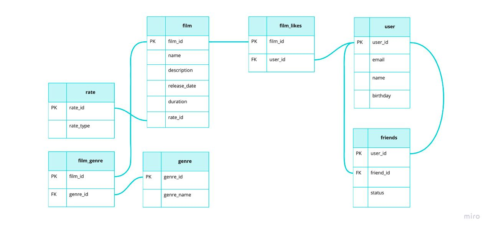

# java-filmorate

film - таблица с данными о фильме. Таблица связана с:
 - film_rate - связь фильмов и id рейтинга. Данная таблица по полю rate_id связана с таблицей-маппингом идентификатора рейтинга и его наименования - rate
 - film_genre - связь фильмов и id жанра. Данная таблица по полю genre_id связана с таблицей-маппингом идентификатора жанра и его наименования - genre
 - film_likes - содержит связь идентификатора фильма и идентификатора пользователя, поставившего лайк данному фильму

user - таблица с данными о пользователе. 
friends - таблица, которая содержит информацию о запросах в друзья и их статусе.
